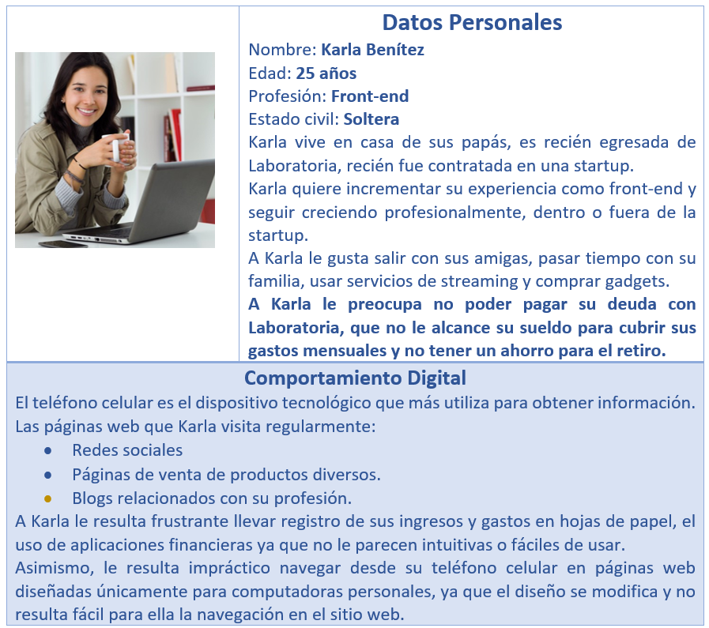
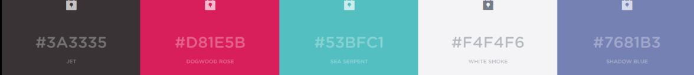
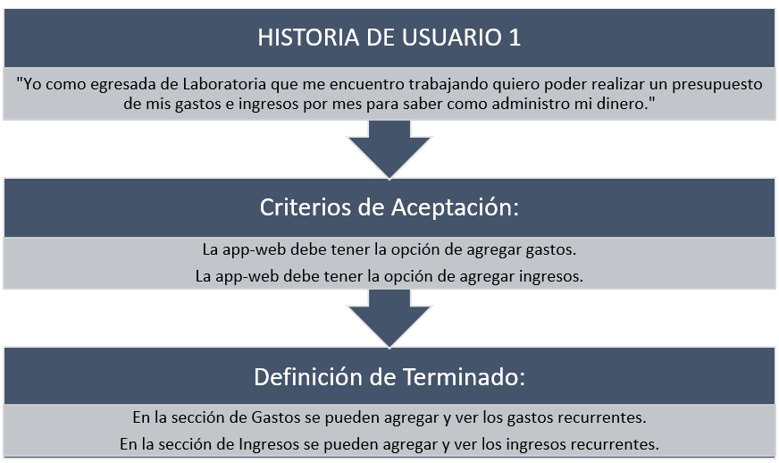
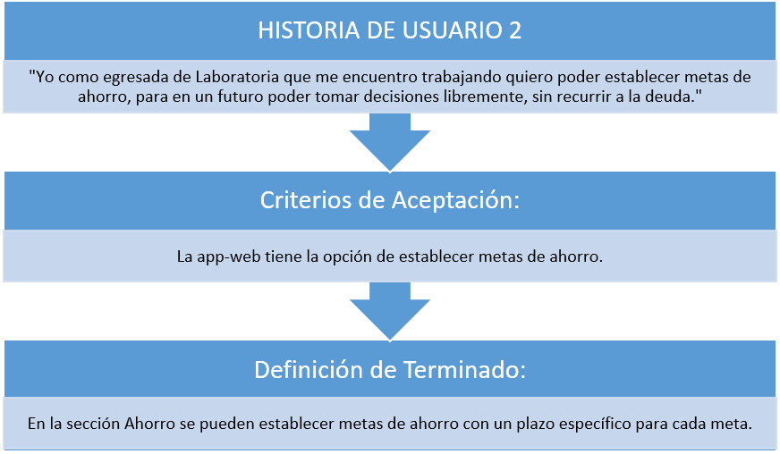
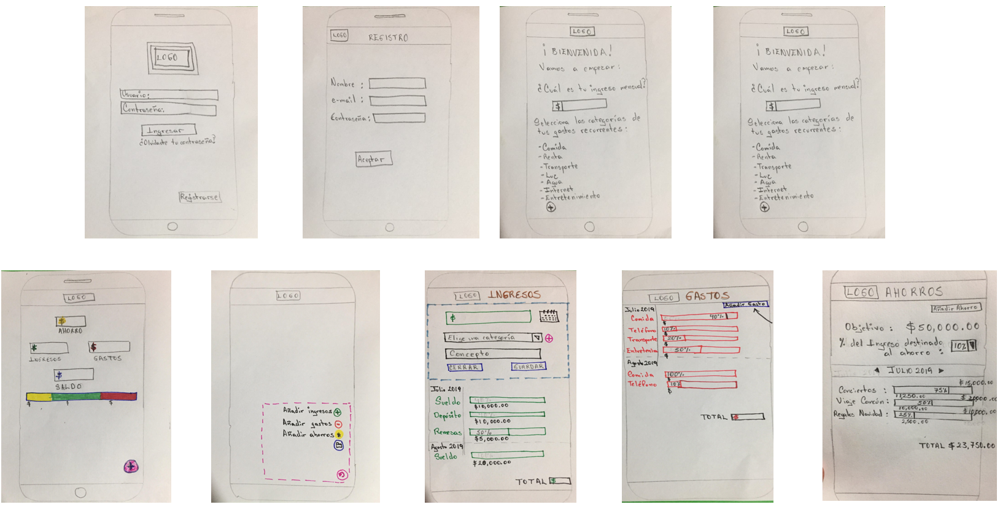
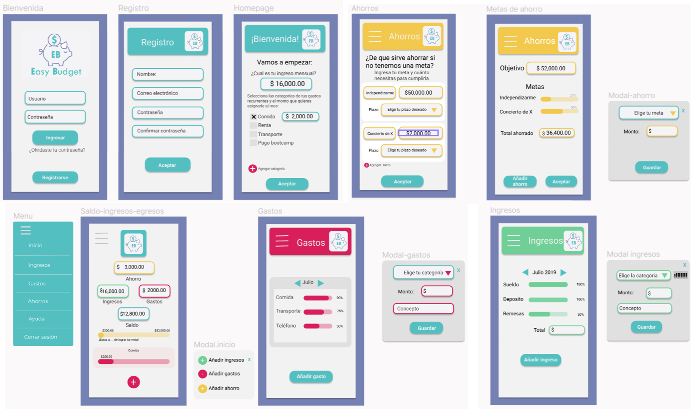

# EASY BUDGET

## Preámbulo

Con la revolución de las fintech (“fin” finanzas, “tech” tecnología) se han desarrollado multitud de aplicaciones que han llegado para quedarse. La comodidad, la rapidez y su fácil uso son los atributos principales que hace de ellas un complemento fundamental para las operaciones financieras del día a día.
Para llevar una mejor gestión de las operaciones financieras, con la disrupción de la tecnología, se han creado diferentes aplicaciones fintech que te permiten realizar, controlar y planificar las diferentes actividades financieras que las personas desarrollan en su vida.
Al mismo tiempo, si bien existen muchas aplicaciones que ayudan a los usuarios a crear un Presupuesto mensual, existe todavía un hueco. No hay aplicaciones que ayuden y eduquen a las personas a planificar sus ingresos, gastos y ahorros con miras a un futuro tanto de corto como de mediano plazo, y para visualizar la mejor estabilidad financiera que podrá tener en su vida.

## Importancia de la gestión saludable de las finanzas

Unas finanzas saludables se traducen en la adecuada administración de los recursos financieros para lograr determinados objetivos personales.

No llevar una adecuada administración de las finanzas personales puede generar efectos contraproducentes en la salud tales como depresión, pesimismo, baja autoestima, ansiedad, estrés, entre otros.

Llevar una gestión saludable de las finanzas nos ayuda a:

- Darnos cuenta de nuestra situación financiera actual.
- Determinar nuestras metas y objetivos.
- Priorizar en qué gastar el dinero.
- Desarrollar un camino o estrategia que nos lleve a lo que queremos lograr.
- Evitar deudas.
- Afrontar gastos imprevistos. 

Además, te permite llevar relaciones sanas con tu pareja o familia. (Wong, 2010).  

La salud financiera fomenta una sociedad más informada, consciente y próspera, opinan los expertos en finanzas.

## Objetivo

Desarrollar una web-app que facilite a las estudiantes y egresadas de Laboratoria establecer metas de ahorro para lograr su estabilidad e independencia financiera y permita la administración eficaz de sus ingresos y gastos.

## Planning

### Instrumento de Investigación

El instrumento de investigación empleado fue una entrevista realizada en persona a cinco de nuestras compañeras.

### User Persona

El User Persona siguiente se generó de los datos de las entrevistas realizadas a nuestras compañeras:

## Inspiraciones en el desarrollo del producto

Como futuras egresadas de Laboratoria y como profesionales en búsqueda de la estabilidad e independencia financiera, decidimos crear Easy Budget® que fungirá como herramienta para toda aquella Laboratorian que tenga la necesidad de conocer cuál sería su ingreso para no sólo cubrir su presupuesto mensual, sino además, lograr sus metas financieras futuras. 
Con este objetivo en mente, nos inspiramos en todas las mujeres de Laboratoria que quieran sentirse motivadas a lograr sus metas, llevar unas finanzas sanas y con ello lograr la independencia financiera. Porque creemos que una mujer financieramente independiente es una mujer con la posibilidad de llevar una vida más plena, con la libertad de crear y ofrecer soluciones, además de promover e inspirar a otras mujeres a seguir sus pasos.
También tomamos de referente la aplicación MoBills®, aplicación de gastos personales, y los comentarios de nuestras compañeras de qué es lo que les gustaría ver en la app-web.

## Diseño Visual

Para el diseño visual de la app-web primero tomamos en cuenta el diseño first-mobile, considerando que el 64% de los usuarios de dispositivos móviles inteligentes navega en internet de forma activa. (IABMéxico, 2013). Y para hacer más sencilla, rápida y práctica el uso de esta herramienta financiera.
El logotipo se realizó y eligió mediante consenso pensando en el significado de la imagen y la relación que tiene con el principal objetivo de la app-web: ahorrar. 

Se eligió el nombre de “Easy Budget”, en español “presupuesto fácil”, porque es parte del objetivo principal que es facilitar llevar un presupuesto, además de que fonéticamente es fácil de recordar.

La paleta de colores se seleccionó pensando en el atractivo visual de la aplicación sin hacerla pesada a la vista y que los colores inspiraran confianza y tranquilidad. Asimismo, procuramos que la interfaz fuera sencilla e intuitiva, sin saturarla de información para que el usuario se familiarice rápido y sea más sencillo el uso continuo de la app-web.

## Historias de Usuarios

## Heurísticas de usabilidad

## Modelo de negocio

Para que la app-web sea un modelo de negocio viable se implementará publicidad en la versión gratuita, con ello, los anunciantes serían la fuente primaria de ingresos para el negocio. 
Si el usuario desea eliminar la publicidad tiene la opción de suscribirse a la versión premium, con cargo mensual, semestral o anual a tarjeta bancaria.

## Prototipado

Se hicieron dos prototipos, uno de baja fidelidad y otro de alta fidelidad. El prototipo de baja fidelidad es un bosquejo que se hizo tomando en cuenta los resultados de las entrevistas al usuario objetivo.
El prototipo de alta fidelidad se hizo después de la primera iteración, realizando ajustes tomando en cuenta los consejos que el usuario objetivo propuso y de observar su interacción con la app-web.

Se hicieron dos prototipos, uno de baja fidelidad y otro de alta fidelidad. El prototipo de baja fidelidad es un bosquejo que se hizo tomando en cuenta los resultados de las entrevistas al usuario objetivo.
El prototipo de alta fidelidad se hizo después de la primera iteración, realizando ajustes tomando en cuenta los consejos que el usuario objetivo propuso y de observar su interacción con la app-web.

### Prototipo de baja fidelidad

###Prototipo de alta fidelidad

## Necesidades técnicas

Este proyecto se realizó con HTML, JavaScript y CSS.

## ¿Cómo ejecutar este proyecto?

Solo necesitas un navegador y dar click en el siguiente link: https://iselareyesperdomo94.github.io/MEX008-hackathon-Interna-SF/

## Bibliografía

Jaime G. Wong, (10 de enero 2010).  “Ocho motivos por qué aprender a administrar tu dinero.” Sueños de Azul. Recuperado de: http://jgwong.org/blog/2007/01/10/ocho-motivos-por-que-aprender-a-administrar-tu-dinero/

IABMéxico. 26 de noviembre 2013. “Estudio de usos y hábitos de dispositivos móviles en México 2013”.  IAB México. Recuperado de: https://www.iabmexico.com/estudios/usos-habitos-dispositivos-moviles-2013/